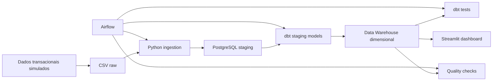
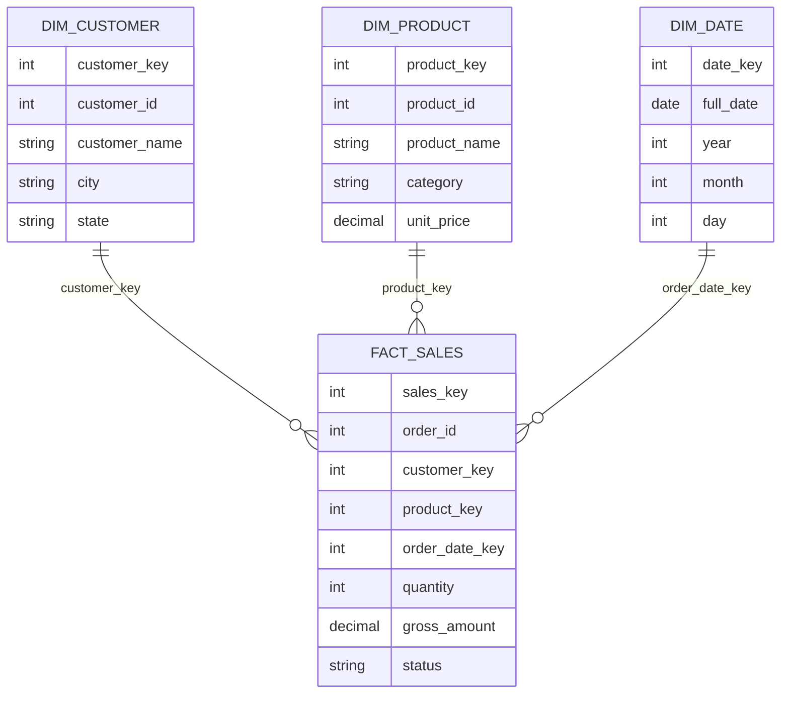

# Pipeline de Vendas: ELT, Data Warehouse, dbt, Airflow e Dashboard

Projeto de engenharia de dados que simula uma operacao de vendas de ponta a ponta: geracao de dados transacionais, ingestao, carga em staging, modelagem dimensional, testes de qualidade, transformacoes com dbt, orquestracao com Airflow e consumo analitico em Streamlit.

Este projeto foi construido para demonstrar competencias praticas de Engenharia de Dados em um fluxo proximo ao usado em ambientes reais.

## O Que Este Projeto Demonstra

- Criacao de pipeline ELT com Python e SQL.
- Separacao entre dados brutos, staging e camada analitica.
- Modelagem dimensional com dimensoes e tabela fato.
- Testes de qualidade e consistencia de dados.
- Transformacoes versionadas e documentadas com dbt.
- Orquestracao do pipeline com Airflow.
- Dashboard analitico com Streamlit.
- Execucao local simplificada com SQLite e versao completa com PostgreSQL/Docker.

## Arquitetura



## Stack

| Categoria | Tecnologias |
| --- | --- |
| Linguagem | Python, SQL |
| Banco de dados | PostgreSQL, SQLite |
| Transformacao | dbt |
| Orquestracao | Airflow |
| Dashboard | Streamlit |
| Ambiente | Docker Compose |
| Bibliotecas | Pandas, psycopg2, python-dotenv |

## Estrutura

```text
projeto-01-pipeline-vendas/
  dags/
    sales_pipeline_dag.py
    sales_pipeline_sqlite_dag.py
  dashboard/
    app.py
  data/
    raw/
  dbt/
    models/
      staging/
      marts/
    tests/
  sql/
    01_create_schemas.sql
    02_create_staging_tables.sql
    03_create_dw_tables.sql
    04_transform_dw.sql
  sqlite/
    schemas.sql
    transform_dw.sql
  src/
    generate_data.py
    load_staging.py
    run_pipeline.py
    quality_checks.py
    run_pipeline_sqlite.py
    quality_checks_sqlite.py
  docker-compose.yml
  docker-compose.airflow.yml
  dbt_project.yml
  profiles.yml.example
  requirements.txt
```

## Fluxo do Pipeline

1. `generate_data.py` gera dados simulados de clientes, produtos, pedidos e itens de pedido.
2. Os arquivos CSV sao salvos em `data/raw`.
3. `load_staging.py` carrega os CSVs para tabelas de staging no PostgreSQL.
4. Os modelos dbt transformam staging em uma camada dimensional.
5. Os testes dbt validam unicidade, nulos, relacionamentos e regras de negocio.
6. `quality_checks.py` executa validacoes adicionais no Data Warehouse.
7. O Airflow orquestra a ordem das tarefas.
8. O Streamlit consome a camada analitica para apresentar indicadores de negocio.

## Modelo de Dados

### Origem / Staging

| Tabela | Descricao |
| --- | --- |
| `staging.customers` | Cadastro de clientes. |
| `staging.products` | Catalogo de produtos. |
| `staging.orders` | Pedidos realizados. |
| `staging.order_items` | Itens vendidos em cada pedido. |

### Data Warehouse

| Tabela | Tipo | Descricao |
| --- | --- | --- |
| `dw.dim_customer` | Dimensao | Dados do cliente, cidade e estado. |
| `dw.dim_product` | Dimensao | Produto, categoria e preco. |
| `dw.dim_date` | Dimensao | Calendario derivado das datas dos pedidos. |
| `dw.fact_sales` | Fato | Venda em nivel de item de pedido, com quantidade e receita. |



## Como Executar

### Opcao 1: demo local com SQLite

Use esta opcao para rodar o projeto sem Docker e sem PostgreSQL.

```powershell
python src/run_pipeline_sqlite.py
python src/quality_checks_sqlite.py
streamlit run dashboard/app.py
```

O dashboard ficara disponivel em:

```text
http://localhost:8501
```

### Opcao 2: PostgreSQL com Docker

```powershell
Copy-Item .env.example .env
docker compose up -d

python -m venv .venv
.\.venv\Scripts\Activate.ps1
pip install -r requirements.txt

python src/run_pipeline.py
python src/quality_checks.py
```

### Opcao 3: dbt

Depois de carregar as tabelas de staging no PostgreSQL:

```powershell
Copy-Item profiles.yml.example profiles.yml
$env:DBT_PROFILES_DIR = "."

dbt debug
dbt run
dbt test
dbt docs generate
```

### Opcao 4: Airflow com Docker

```powershell
docker compose -f docker-compose.airflow.yml up
```

Interface local:

```text
http://localhost:8080
```

Credenciais:

```text
usuario: admin
senha: admin
```

DAGs disponiveis:

- `sales_pipeline_elt`: pipeline principal com PostgreSQL, dbt e checagens.
- `sales_pipeline_sqlite_demo`: demo local com SQLite.

## Dashboard

O dashboard em Streamlit mostra:

- receita total;
- total de pedidos;
- ticket medio;
- unidades vendidas;
- receita por mes;
- receita por categoria;
- top 10 produtos;
- receita por estado;
- status dos pedidos;
- filtros por periodo, estado, categoria e status.

## Testes de Qualidade

O projeto possui duas camadas de validacao:

| Camada | Exemplos |
| --- | --- |
| dbt tests | `not_null`, `unique`, `relationships`, `accepted_values` |
| Python SQL checks | fato com registros, chaves nao nulas, venda positiva, consistencia de receita |

Exemplo de regra validada:

```text
gross_amount = quantity * unit_price
```

## Consultas de Exemplo

Receita por mes:

```sql
select
    d.year,
    d.month,
    sum(f.gross_amount) as revenue
from dw.fact_sales f
join dw.dim_date d on d.date_key = f.order_date_key
group by d.year, d.month
order by d.year, d.month;
```

Top produtos:

```sql
select
    p.category,
    p.product_name,
    sum(f.quantity) as units_sold,
    sum(f.gross_amount) as revenue
from dw.fact_sales f
join dw.dim_product p on p.product_key = f.product_key
group by p.category, p.product_name
order by revenue desc
limit 10;
```

## Decisoes Tecnicas

- O pipeline usa ELT: os dados entram primeiro em staging e depois sao transformados no banco.
- A camada raw preserva arquivos CSV gerados como simulacao de origem.
- O staging mantem os identificadores naturais da origem.
- O Data Warehouse usa modelagem dimensional para facilitar analises.
- O dbt centraliza transformacoes, testes e documentacao dos modelos.
- O Airflow torna explicita a dependencia entre ingestao, transformacao e validacao.
- O SQLite permite demonstrar o projeto em maquinas sem Docker.
- O Streamlit conecta o trabalho tecnico a indicadores de negocio.

## Resultado Local Validado

Na demo local com SQLite, o pipeline gerou:

| Metrica | Valor |
| --- | --- |
| Linhas na fato | 768 |
| Pedidos | 300 |
| Receita simulada | R$ 2.840.114,60 |

## Proximas Melhorias

- Adicionar screenshot real do dashboard ao README.
- Publicar o dashboard em Streamlit Community Cloud ou container Docker.
- Salvar a camada raw em Parquet.
- Criar uma versao com Data Lake usando PySpark.
- Adicionar monitoramento de qualidade com alertas.
