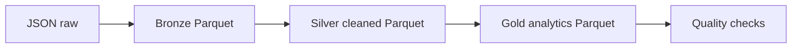

# Data Lake com PySpark e Parquet

Projeto de Engenharia de Dados que simula um Data Lake em camadas usando arquivos JSON como origem, processamento com PySpark e armazenamento em Parquet.

O objetivo e demonstrar conceitos de lakehouse local: separacao entre dados brutos, bronze, silver e gold, alem de validacoes de qualidade e agregacoes analiticas.

## O Que Este Projeto Demonstra

- Organizacao de um Data Lake em camadas.
- Ingestao de dados semi-estruturados em JSON.
- Processamento distribuido com PySpark.
- Escrita em formato colunar Parquet.
- Limpeza e padronizacao na camada silver.
- Criacao de tabelas analiticas na camada gold.
- Validacoes de qualidade sobre dados processados.

## Arquitetura



## Camadas

| Camada | Descricao |
| --- | --- |
| `raw` | Arquivos JSON simulando dados de origem. |
| `bronze` | Dados convertidos para Parquet, preservando a estrutura da origem. |
| `silver` | Dados limpos, tipados e padronizados. |
| `gold` | Agregacoes prontas para analise. |

## Estrutura

```text
projeto-02-data-lake-pyspark/
  data/
    raw/
    bronze/
    silver/
    gold/
  src/
    generate_data.py
    build_lakehouse.py
    quality_checks.py
    run_pipeline.py
  requirements.txt
  README.md
```

## Como Executar

Requisitos:

- Python 3.10+
- Java instalado e disponivel no `PATH` para executar o PySpark

1. Crie e ative um ambiente virtual:

```powershell
python -m venv .venv
.\.venv\Scripts\Activate.ps1
```

2. Instale as dependencias:

```powershell
pip install -r requirements.txt
```

3. Execute o pipeline:

```powershell
python src/run_pipeline.py
```

4. Rode as checagens de qualidade:

```powershell
python src/quality_checks.py
```

## Datasets Simulados

- `customers.json`
- `products.json`
- `orders.json`
- `order_items.json`

## Tabelas Gold

| Tabela | Descricao |
| --- | --- |
| `daily_sales` | Receita, pedidos e unidades por dia. |
| `product_sales` | Receita e unidades por produto e categoria. |
| `state_sales` | Receita e pedidos por estado. |

## Regras de Qualidade

- Camadas silver e gold devem possuir registros.
- Pedidos devem ter clientes validos.
- Itens de pedido devem ter produtos validos.
- Quantidade deve ser positiva.
- Receita deve ser consistente com quantidade e preco unitario.

## Decisoes Tecnicas

- JSON foi usado na origem para representar dados semi-estruturados comuns em Data Lakes.
- Parquet foi usado nas camadas processadas por ser colunar, comprimido e eficiente para consultas analiticas.
- A camada bronze preserva os dados da origem com pouca transformacao.
- A camada silver aplica tipos, limpeza e relacionamentos.
- A camada gold entrega agregacoes prontas para consumo.

## Proximas Melhorias

- Adicionar particionamento por data.
- Adicionar Delta Lake.
- Criar catalogo de metadados.
- Orquestrar com Airflow.
- Publicar os dados em um bucket S3 ou similar.
